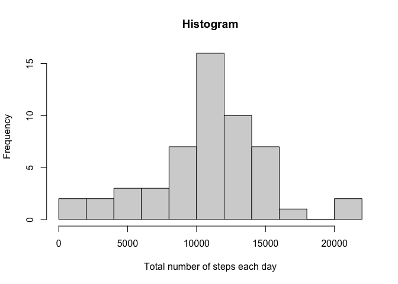
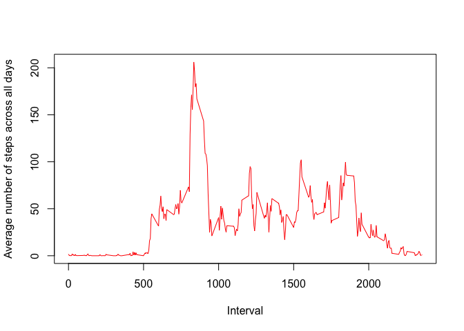
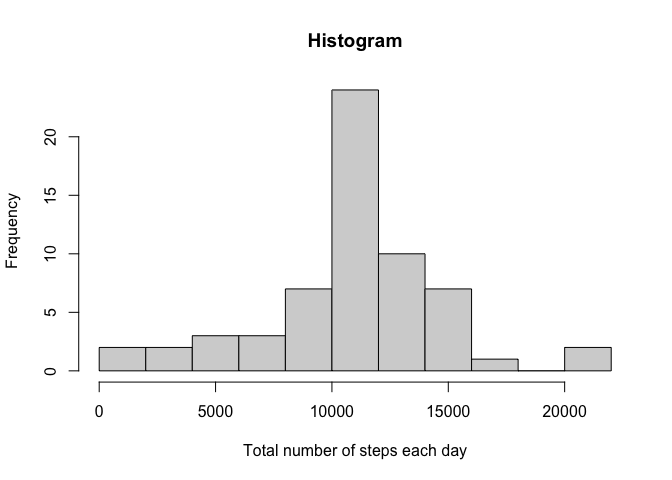
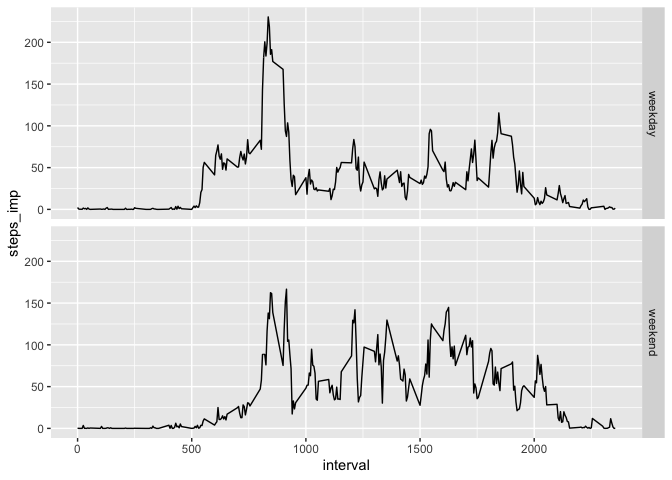

---
title: "Reproducible Research: Peer Assessment 1"
output: 
  html_document:
    keep_md: true
---
  

## Loading and preprocessing the data


```r
#Setting work directory
setwd("/Users/emilienielsen/Documents/Coursera/Reproducible/Project1")

#Read in data
data <- read.csv("activity.csv", header=T)

#Remove missing values
data1 <- na.omit(data)
```

## What is mean total number of steps taken per day?


```r
#Calculating total number of steps
df <- data.frame(tapply(data1$steps, data1$date, "sum"))
names(df) <- "Total"
df$day <- rownames(df)
hist(df$Total, breaks=10, xlab="Total number of steps each day", main="Histogram")
```

<!-- -->

Mean and median:


```r
mean <- mean(df$Total)
median <- median(df$Total)
data.frame("mean"=mean, "median"=median)
```

```
##       mean median
## 1 10766.19  10765
```

## What is the average daily activity pattern?


```r
#Calculating total number of steps
df <- data.frame(tapply(data1$steps, data1$interval, "mean"))
names(df) <- "Average"
df$interval <- rownames(df)

plot(df$interval, df$Average, type="l", xlab="Interval", ylab="Average number of steps across all days", col="red")
```

<!-- -->

The 5 minute interval across all days that contains maximum number of steps:


```r
df[df$Average==max(df$Average),]$interval
```

```
## [1] "835"
```

## Imputing missing values

Total number of missing values:


```r
sum(is.na(data))
```

```
## [1] 2304
```

Imputing by mean for steps column by intervals across days (like in the time series plot of the average number of steps taken). The new dataset is called data_imp:


```r
#Merge datas et with missing values and the average steps per interval
df1 <- cbind(data, df)[,-5]

#Imputing by average if NA
df1$steps_imp <- ifelse(is.na(df1$steps), df1$Average, df1$steps)

#Creating new imputed dataset
data_imp <- df1[,-c(1,4)]
```

Histogram of the total number of steps taken each day after missing values are imputed:


```r
#Calculating total number of steps for the imputed steps variable
df2 <- data.frame(tapply(data_imp$steps_imp, data_imp$date, "sum"))
names(df2) <- "Total"
df2$day <- rownames(df2)
hist(df2$Total, breaks=10, xlab="Total number of steps each day", main="Histogram")
```

<!-- -->

Mean and median with imputed values:


```r
mean <- mean(df2$Total)
median <- median(df2$Total)
data.frame("mean"=mean, "median"=median)
```

```
##       mean   median
## 1 10766.19 10766.19
```

The histogram is a bit different, with higher frequencies in the middle region. The mean is the same (as we have mean imputed) and the median is now also equal to the mean.

## Are there differences in activity patterns between weekdays and weekends?


```r
#Transforming the date variable
data_imp$date <- as.Date(data_imp$date)

#Making the variable defining weekday or weekend
data_imp$week <- ifelse((weekdays(data_imp$date)=="Lørdag" | weekdays(data_imp$date)=="Søndag"), "weekend", "weekday")
```


```r
library(ggplot2)
#Calculating total number of steps across the intervals and weekdays
agg <- aggregate(steps_imp~interval+week, data=data_imp, FUN="mean")
qplot(interval, steps_imp, data=agg, facets = week~., geom="line")
```

<!-- -->

From interval 1000 and higher, we see a larger activity in the weekends. Around interval 800 there is a larger activity in the weekdays.


